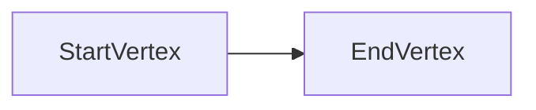
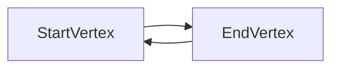

# Manual for Megarachne 1.0.0

[TOC]

## Introduction

### Info

Hello! Thank you for using Megarachne! ;)

Megarachne is an open-source plug-in for Grasshopper.

**Purpose: **Megarachne can help you to use graph theory with Grasshopper.

**Requirements:** Rhino 6 or Rhino 7

**Contact:** If you have any specific questions, email me: w.radaczynski@gmail.com

**Website:** www.code-structures.com

**Tutorials:** You can find many tutorials on my YT channel here: https://www.youtube.com/channel/UCfXkMo1rOMhKGBoNwd7JPsw

### License (MIT License)

Copyright © 2021 Wojciech Radaczyński

Permission is hereby granted, free of charge, to any person obtaining a copy of this software and
associated documentation files (the "Software"), to deal in the Software without restriction,
including without limitation the rights to use, copy, modify, merge, publish, distribute, sublicense,
and/or sell copies of the Software, and to permit persons to whom the Software is furnished to
do so, subject to the following conditions:
The above copyright notice and this permission notice shall be included in all copies or
substantial portions of the Software.

THE SOFTWARE IS PROVIDED "AS IS", WITHOUT WARRANTY OF ANY KIND, EXPRESS OR IMPLIED,
INCLUDING BUT NOT LIMITED TO THE WARRANTIES OF MERCHANTABILITY, FITNESS FOR A
PARTICULAR PURPOSE AND NONINFRINGEMENT. IN NO EVENT SHALL THE AUTHORS OR
COPYRIGHT HOLDERS BE LIABLE FOR ANY CLAIM, DAMAGES OR OTHER LIABILITY, WHETHER IN
AN ACTION OF CONTRACT, TORT OR OTHERWISE, ARISING FROM, OUT OF OR IN CONNECTION
WITH THE SOFTWARE OR THE USE OR OTHER DEALINGS IN THE SOFTWARE.

### How does Megarchne work

Megarachne allows you to convert Rhino/Grasshopper geometry into graphs and solve specific problems with it.

Actually all the Megarachne's graphs are directed and all of the edges have weights that are equal to the length of those weights.

## Graph Part

### About

Graph Part components can help you to create parts of the Graph. They convert Rhino/Grasshopper geometry into those parts.

### Is Directed?

All those components will ask you if you want to have the edge of the Graph Part directed or not. If it's directed, than your Graph Part's edge will be directed, and it's direction is from the start vertex to end vertex.

When you set the value False, then the edge is not directed, but actually **it creates 2 directed edges**, where one is directed from start vertex to end vertex, and the second one is from end vertex to start vertex.

### Components

#### Curve To Graph Part

It converts whatever curve you have into the Graph Part:

- Takes start point of your curve - converts to the start vertex.

- Takes whole curve - converts to the edge.

- Takes end point of your curve - converts to the end vertex.

#### Two Points To Graph Part

It converts two points into the Graph Part, where the first point is the start vertex, the second point is the end vertex, and the line created by those points is an edge.

#### Vector To Graph Part

It converts vectors into Graph Parts, where the Point (start point) input is the start vertex, then it creates end point by moving start point by Vector input and converts it to end vertex, and then it creates the line between both points, that will become an edge.

#### Deconstruct Graph Part

## Graph

### About

Graph components will help you to create Graph and to analyze some of it's properties.

There are 2 ways to create Graphs: by creating Graph Parts or by converting the whole mesh created with Grasshopper.

### Components

#### Create Graph

This component takes the Graph Parts as input to create whole Graph.

Tolerance input will help you to compare different vertices and to decide if they are the same. If the vertices are the same (the x, y, z positions of points are the same) then it will use it as one vertex.

The component does not compare edges geometries to each other. If there are two graph parts with the same line as an edge - it will treat it as two separate edges.

#### Mesh To Graph

This component takes the mesh as input to create whole Graph.

It treats the mesh's vertices as graph vertices and mesh edges as graph edges. Actually or mesh edges are being converted to two separate edges where one is directed in one direction, and the second one in the opposite direction.

**Important note:** Sometimes meshes are not properly created, even using built-in components, for example:

If you study how this mesh is created, you can see that some of the vertices are duplicated. Mesh To Graph component will create errors when things like this happens inside input mesh. 

There are some ways to fix these types of meshes. Personally I use Pufferfish components: [Pufferfish](https://www.food4rhino.com/app/pufferfish). It has Rebuild Mesh component that can deal with all that stuff.

#### Deconstruct Graph

#### Graph To Report Part

If you use Pterodactyl plugin then you can convert a graph to the Flowchart that can be used to visualize graph.

It works well only for small graphs, for the large ones it can become barely readable.

#### Get Closest Vertex

This one can be really helpful: it takes the Point as an input and it finds vertex of the Graph that is the closest to this input point. It returns the closest vertex by giving it's index. It's really helpful if you want to find a specific vertex.

#### Get Graph Degree

Returns degree of the graph.

#### Get Vertex Degree

Returns degree of the vertex. It also returns it's in- and out- degree.

## Algorithm

### About

These components allow you to use different graph algorithms. There are based on Dijkstra, A* and BFS algorithms.

### Components

#### BFS Is Graph Connected

This component will check if the Graph is connected using BFS.

#### BFS Search / Dijkstra Search

These components will create

#### BFS Shortest Path / Dijkstra Shortest Path / A* Shortest Path

These components will search for the shortest path between given vertices.

Here is a quick comparison of these three components:

|                                        |              BFS Shortest Path               | Dijkstra Shortest Path | A* Shortest Path |
| -------------------------------------- | :------------------------------------------: | :--------------------: | :--------------: |
| Analyze weights of the edges in graphs |                      No                      |          Yes           |       Yes        |
| Speed                                  |                     +++                      |           -            |        +         |
| Result                                 | Path that contains the least number of edges |     Shortest path      |  Shortest path   |

From my own experience I have to say that when you use a mesh to create a graph, and this origin mesh has edges that have equal length (for Megarachne it means: equal weight), then BFS will be the best, because it will be the fastest, and it will actually give you the shortest path anyway. It's because BFS doesn't care about weight of an edges - it returns the path that contains the least number of edges.

If your graph has edges with different weights (lengths) then A* should be the best for you.

You can always check which vertices where visited during search of the shortest path - there are in "Visited" output.

Of course if it couldn't find any path - then the component will throw an exception.