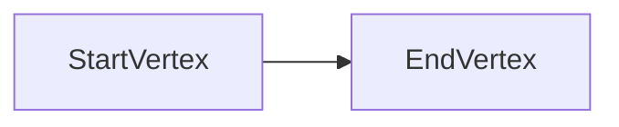
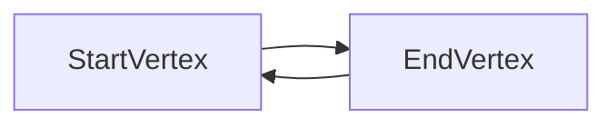
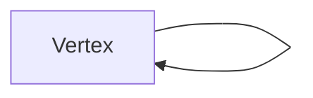

# Manual for Megarachne 1.0.0

[TOC]

## Introduction

### Info


Hello! Thank you for using Megarachne! ;)

Megarachne is an open-source plug-in for Grasshopper.

**Purpose: **Megarachne can help you to use graph theory with Grasshopper.

**Requirements:** Rhino 6 or Rhino 7

**Contact:** If you have any specific questions, email me: w.radaczynski@gmail.com

**Website:** www.code-structures.com

**Tutorials:** You can find many tutorials on my YT channel here: https://www.youtube.com/channel/UCfXkMo1rOMhKGBoNwd7JPsw

### License (MIT License)

Copyright © 2021 Wojciech Radaczyński

Permission is hereby granted, free of charge, to any person obtaining a copy of this software and
associated documentation files (the "Software"), to deal in the Software without restriction,
including without limitation the rights to use, copy, modify, merge, publish, distribute, sublicense,
and/or sell copies of the Software, and to permit persons to whom the Software is furnished to
do so, subject to the following conditions:
The above copyright notice and this permission notice shall be included in all copies or
substantial portions of the Software.

THE SOFTWARE IS PROVIDED "AS IS", WITHOUT WARRANTY OF ANY KIND, EXPRESS OR IMPLIED,
INCLUDING BUT NOT LIMITED TO THE WARRANTIES OF MERCHANTABILITY, FITNESS FOR A
PARTICULAR PURPOSE AND NONINFRINGEMENT. IN NO EVENT SHALL THE AUTHORS OR
COPYRIGHT HOLDERS BE LIABLE FOR ANY CLAIM, DAMAGES OR OTHER LIABILITY, WHETHER IN
AN ACTION OF CONTRACT, TORT OR OTHERWISE, ARISING FROM, OUT OF OR IN CONNECTION
WITH THE SOFTWARE OR THE USE OR OTHER DEALINGS IN THE SOFTWARE.

### How does Megarchne work

Megarachne allows you to convert Rhino/Grasshopper geometry into graphs and solve specific problems with it.

Actually all the Megarachne's graphs are directed and all of the edges have weights that are equal to the length of those weights.

## Graph Part

### About

Graph Part components can help you to create parts of the Graph. They convert Rhino/Grasshopper geometry into those parts.

### Is Directed?

All those components will ask you if you want to have the edge of the Graph Part directed or not. If it's directed, than your Graph Part's edge will be directed, and it's direction is from the start vertex to end vertex.



When you set the value False, then the edge is not directed, but actually **it creates 2 directed edges**, where one is directed from start vertex to end vertex, and the second one is from end vertex to start vertex.



### Components

#### Curve To Graph Part


It converts whatever curve you have into the Graph Part:

- Takes start point of your curve - converts to the start vertex.
- Takes whole curve - converts to the edge.
- Takes end point of your curve - converts to the end vertex.

Also this one component allows you to create a loop. You can do this by creating a curve that has the same start and end point:





The weight of the edge will be always the length of the curve. This allows to analyze complex sets of curves as graphs:


#### Two Points To Graph Part

It converts two points into the Graph Part, where the first point is the start vertex, the second point is the end vertex, and the line created by those points is an edge.


The weight of an edge will be equal to the distance between both points.

#### Vector To Graph Part

It converts vectors into Graph Parts, where the Point (start point) input is the start vertex, then it creates end point by moving start point by Vector input and converts it to end vertex, and then it creates the line between both points, that will become an edge.


The weight of an edge will be equal to the length of the input vector.

#### Deconstruct Graph Part

It deconstructs the Graph Part to it's elements.


## Graph

### About

Graph components will help you to create Graph and to analyze some of it's properties.

There are 2 ways to create Graphs: by creating Graph Parts or by converting the whole mesh created with Grasshopper.

### Graph Array & Adjacency List

These two elements are being created every time you create new / update a Graph.

**Graph Array** is a Graph representation, where each row represents each edge, and it contains start vertex id and end vertex id. For example if you have an edge that has 0;1; - it means that start vertex of this edge is vertex Id=0, and end vertex of this edge is vertex Id=1. Let's analyze one Graph Array:


This Graph Array shows us that our Graph has 3 edges, where

- Edge Id=0 has start vertex Id=0 and end vertex Id=1
- Edge Id=1 has start vertex Id=0 and end vertex Id=2
- Edge Id=2 has start vertex Id=1 and end vertex Id=2

**Adjacency List** is another Graph representation, where each row represents each vertex, and it contains it's neighbors id. For example if the vertex has one neighbor vertex Id=5, then it's vertex will have 5; in this list. If it has few neighbors, for example vertices Id=1, Id=4, Id=7, then in Adjacency List it will be represented as 1;4;7;. If the vertex have no neighbors, than it will be empty for that vertex. Let's analyze an example:


This Adjacency List shows us that our Graph has 3 vertices, where

- Vertex Id=0 has two neighbors: vertex Id=1 and vertex Id=2
- Vertex Id=1 has one neighbor: vertex Id=2
- Vertex Id=2 has no neighbors

You can easily use Text Split component, and split it by ";" to get specific Id if you need to.

### Getting Vertices / Edges by it's Id

Cool, but you could ask: what can I do with these bare ids of different vertices while you analyze Graph Array or Adjacency List. 

All vertices and edges are ordered by it's Id! It means that you can actually easily get vertex or edge by Id just by using built-in Grasshopper component List item:


In this example we get vertex Id=7 from the Graph.

Now let's do the same with Edges:


This way we found an edge Id=31 inside this Graph.

### Components

#### Create Graph

This component takes the Graph Parts as input to create whole Graph.

Tolerance input will help you to compare different vertices and to decide if they are the same. If the vertices are the same (the x, y, z positions of points are the same) then it will use it as one vertex.

The component does not compare edges geometries to each other. If there are two graph parts with the same line as an edge - it will treat it as two separate edges.

To understand it more, few simple examples:

1. Graph with one directed Graph Part

   

   We can visualize this graph like this:

   ```mermaid
   graph LR
   	0 --> 1
   ```

   Which means that there is one directed edge, and Graph component converted it to Graph Array with one row with an edge 0;1. It also created Adjacency List with 2 elements (2 vertices), so we know that vertex Id=0 has one neighbor: vertex Id=1, but vertex Id=0 doesn't have any neighbors (empty).
   
2. Graph with one undirected Graph Part

   

   This is the same Graph Part but it's not directed. We can visualize it like this:

   ```mermaid
   graph LR
   	0 --> 1;
   	1 --> 0;
   ```

   We can see that Graph Array has right now 2 rows (2 edges): 0;1 and 1;0 as well as we can see that there are 2 edges outputs. These are 2 lines, but the second one is reversed. Also in Adjacency List we can see, that vertex Id=1 has finally a neighbor: vertex Id=0.

3. Graph with two separate Graph Parts

   

   Here we have two separate directed Graph Parts. Let's visualize it:

   ```mermaid
   graph LR
   	0 --> 1;
   	2 --> 3;
   ```

   They are not connected with each other, Graph Array contains 2 rows: 0;1 and 2;3.

4. Graph with two Graph Parts

   

   This example will show you how Graph components analyze Vertices.

   ```mermaid
   graph LR
   	0 --> 1;
   	0 --> 2;
   ```

   As you can see: Graph component realized that both Graph Parts have the same vertex input (point with coordinates: 0,0,0). So it doesn't create separate two vertices that have the same coordinates, but it merged them into one vertex, with Id=0. Tolerance input affects how close both points can be next to each other to merge it into one. Graph Array: 0;1, 0;2.

5. Triangle

   

   ```mermaid
   graph LR
   	0 --> 2;
   	0 --> 1;
   	1 --> 2;
   ```

#### Mesh To Graph

This component takes the mesh as input to create whole Graph.

It treats the mesh's vertices as graph vertices and mesh edges as graph edges. Actually or mesh edges are being converted to two separate edges where one is directed in one direction, and the second one in the opposite direction. Let's see some examples:

1.  Quad single-face mesh:

   

   

   You can see it there: It has 8 edges, because there are 4 edges times 2 (first in one direction, second in another direction).

2. Triangle single-face mesh:

   

   No surprise it has 6 edges now.

3. Triangle two-face mesh:

   

   As you can see: the same mechanism like it's in the Create Graph component is working. There shouldn't be duplicate vertices, we have 4 vertices here.

   But why there is no Tolerance input to check which points are overlapping, like it is in Create Graph?

   Because it doesn't really checking it. It reads the mesh like it is, so if the mesh is correctly made then it shouldn't be duplicate vertices in it!

   If your mesh has duplicates vertices - well it's not quite good, read an "Important note" below, to check how you can deal with it.

4. Surface to mesh example:

   It's often really useful to turn surface to mesh, and turn it into graph.

   

   We have to refine the mesh to better represent input surface:

   

   As you can see, we can turn mesh to large graph, and then analyze it.


**Important note:** Sometimes meshes are not properly created, even using built-in components, for example:


If you study how this mesh is created, you can see that some of the vertices are duplicated. Mesh To Graph component will create errors when things like this happens inside input mesh. 

There are some ways to fix these types of meshes. Personally I use Pufferfish components: [Pufferfish](https://www.food4rhino.com/app/pufferfish). It has Rebuild Mesh component that can deal with all that stuff:


#### Deconstruct Graph

It deconstructs the Graph to it's elements.


#### Graph To Report Part

If you use Pterodactyl plugin then you can convert a graph to the Flowchart that can be used to visualize graph.


It works well only for small graphs, for the large ones it can become barely readable.

#### Get Closest Vertex

This one can be really helpful: it takes the Point as an input and it finds vertex of the Graph that is the closest to this input point. It returns the closest vertex by giving it's index. It's really helpful if you want to find a specific vertex.


#### Get Graph Degree

Returns degree of the graph.

#### Get Vertex Degree

Returns degree of the vertex. It also returns it's in- and out- degree.

## Algorithm

### About

These components allow you to use different graph algorithms. There are based on Dijkstra, A* and BFS algorithms.

### Components

#### BFS Is Graph Connected

This component will check if the Graph is connected using BFS.


The component is limited: if you created your Graph by Create Graph component and you've used directed Graph Part - then it won't work. It's because if you want to find out if your directed graph is connected (weakly connected) - then the plugin should actually create a new graph where every edge is replaced by the undirected edge, and then check it out. This mechanism is not implemented.

#### BFS Search / Dijkstra Search

These components will create Previous Array and will show you Visited vertices.

Inputs:

- Start Vertex Index is needed to know from which vertex search will start.

- BFS Search has Keep Searching input, because it can keep searching even if the graph is not connected. If you set it True: it will keep jumping to not visited vertices. False = it will behave casual: it will start the search naturally.

Outputs:

- Visited are list of points that shows visited vertices during the search
- Previous Array is an array of integers, that contains indexes of previously visited vertices. We will understand it while we'll analyze few examples above

Examples:

1. One directed edge, start vertex Id=0

   

   We can visualize this graph like this:

   ```mermaid
   graph LR
   	0 --> 1
   ```
   
   We started the search from vertex Id=0 and then we visited vertex Id=1 from there. As you can see in Previous Array: vertex Id=0 hasn't visited any vertex, that's why it has -1 there, and vertex Id=1 has previously visited vertex Id=0.

2. One directed edge, start vertex Id=1

   

   This is the same example as above, but we started search from vertex Id=1. That's why we couldn't get to the vertex 0, and we see that the only vertex visited was vertex Id=1.

3. Triangle with additional edge, start vertex Id=0

   

   ```mermaid
   graph LR
   	0 --> 1;
   	1 --> 2;
   	0 --> 2;
   	2 --> 3;
   ```

   As you can see we can only get to vertex Id=3 by vertex Id=2 - that's why during BFS search Previous Array's position=3 was set to 2.

4. Not connected

   

#### BFS Shortest Path / Dijkstra Shortest Path / A* Shortest Path

These components will search for the shortest path between given vertices.

Here is a quick comparison of these three components:

|                                        |              BFS Shortest Path               | Dijkstra Shortest Path | A* Shortest Path |
| -------------------------------------- | :------------------------------------------: | :--------------------: | :--------------: |
| Analyze weights of the edges in graphs |                      No                      |          Yes           |       Yes        |
| Speed                                  |                     +++                      |           -            |        +         |
| Result                                 | Path that contains the least number of edges |     Shortest path      |  Shortest path   |

From my own experience I have to say that when you use a mesh to create a graph, and this origin mesh has edges that have equal length (for Megarachne it means: equal weight), then BFS will be the best, because it will be the fastest, and it will actually give you the shortest path anyway. It's because BFS doesn't care about weight of an edges - it returns the path that contains the least number of edges.

If your graph has edges with different weights (lengths) then A* should be the best for you.

You can always check which vertices where visited during search of the shortest path - there are in "Visited" output.

Of course if it couldn't find any path - then the component will throw an exception.

## Visualization

### About

There are no built-in visualization tools in Megarachne that will allow you to display stuff in Grasshopper. The only one is Graph To Report Part, but it will show you only the scheme of a small graph in Markdown editor. But you can use built-in Grasshopper components to do it, and it's pretty easy!

### Graph


### Path